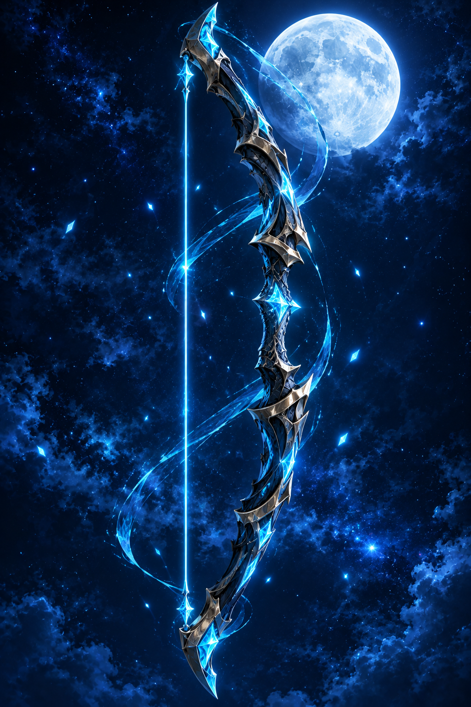
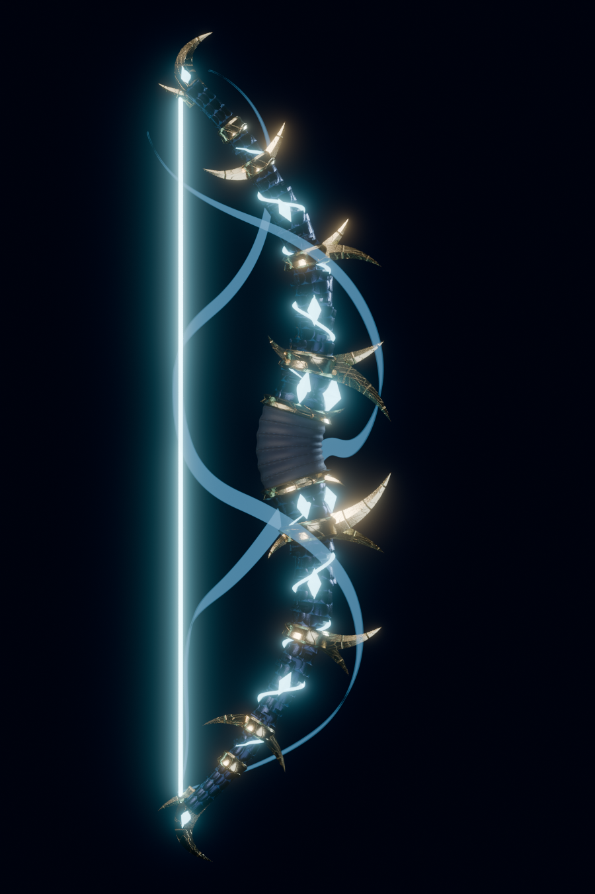
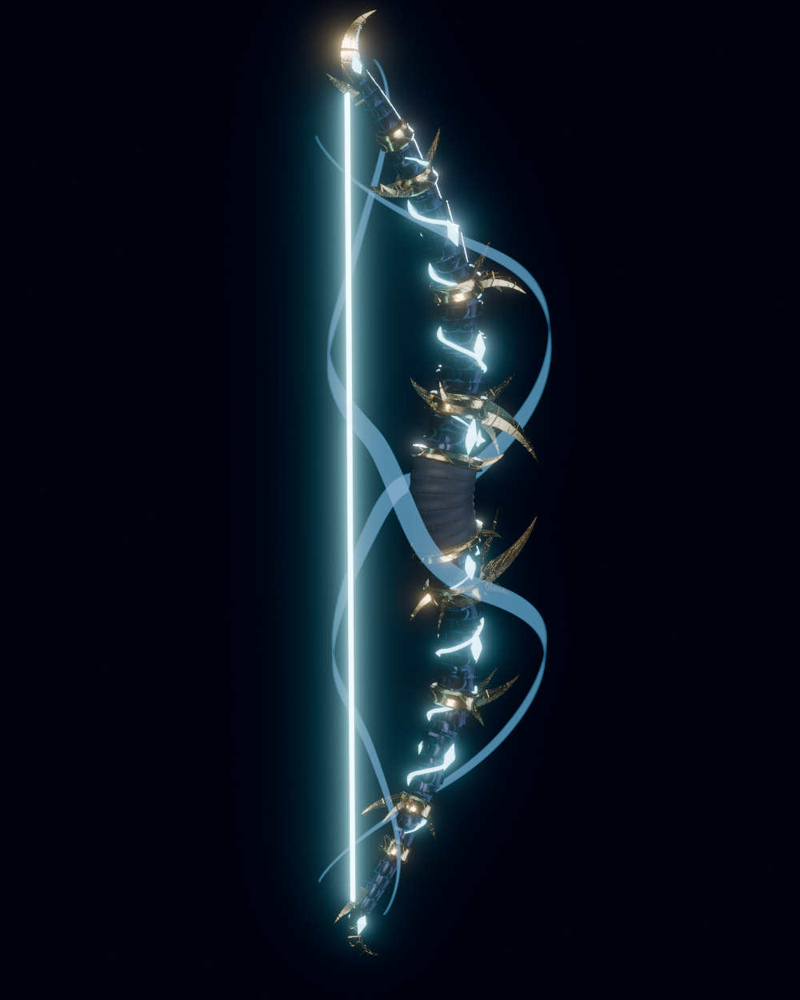
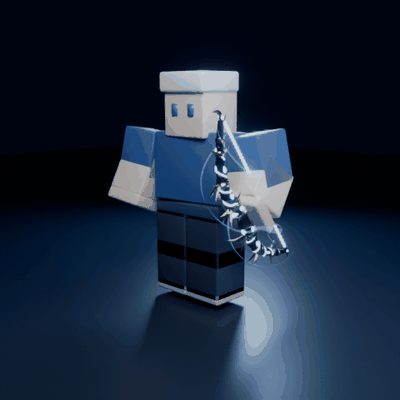
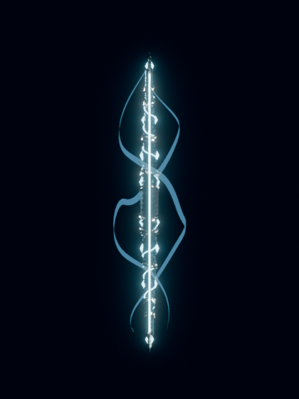
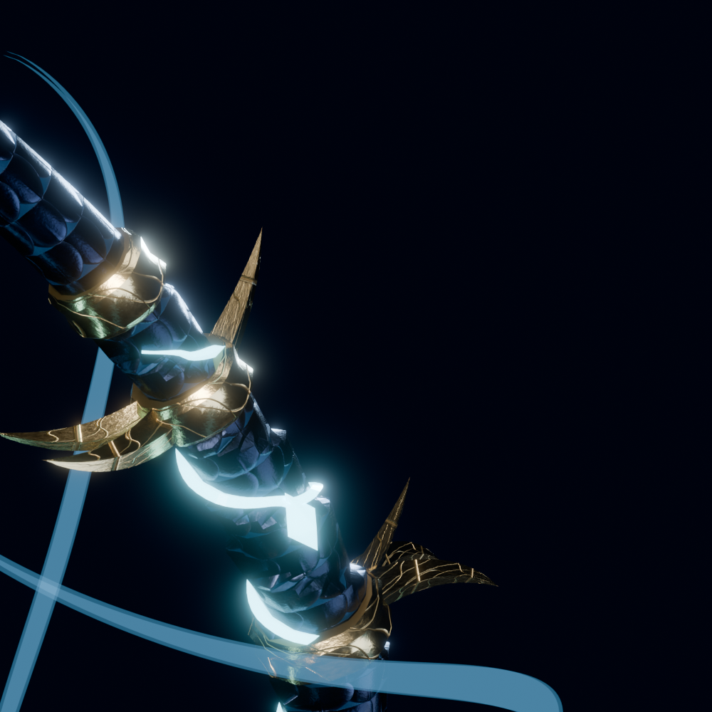
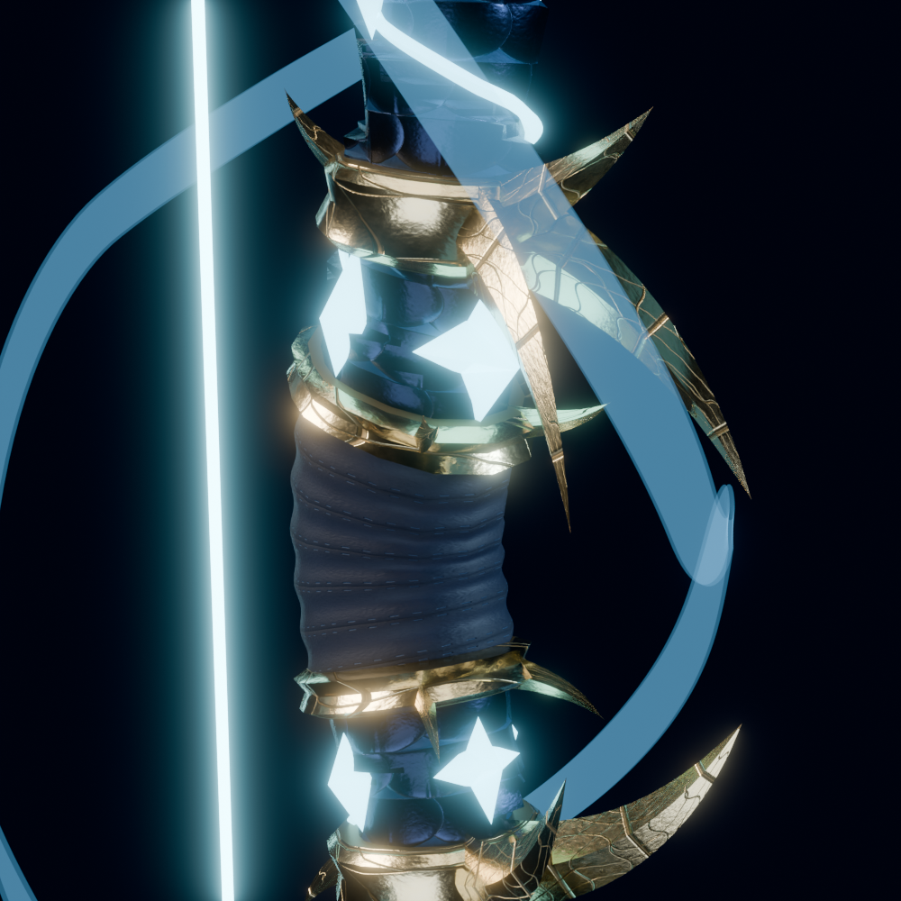
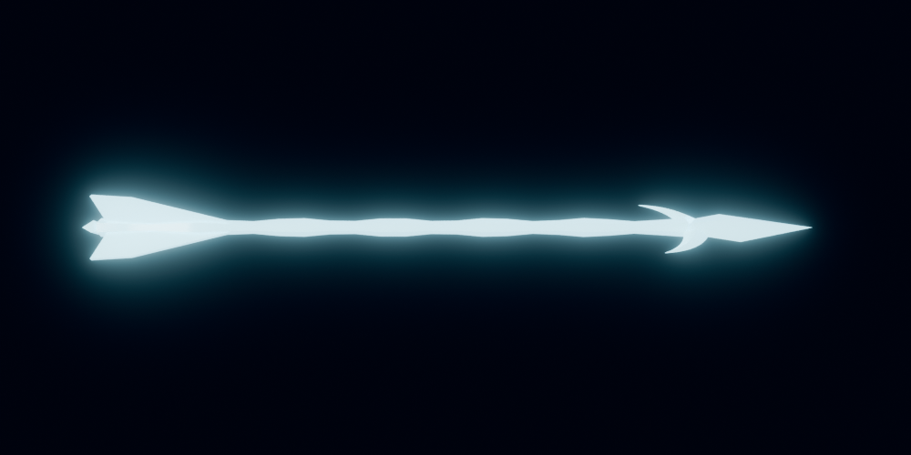

# 🌙 Arco Lunar — arco anime para Roblox (R15)

Modelo 3D del arco del concepto (`reference/concepto.png`), listo para Roblox, con
**animaciones estilo anime para personajes R15**, cuerda de energía que se tensa con la mano,
flecha de cristal, disparo cargado y un movimiento especial.

| Concepto | Modelo (perfil) | Modelo (3/4) |
|---|---|---|
|  |  |  |

 

| Placas de acero de dragón y oro grabado | Empuñadura y cristal corazón | Flecha de cristal |
|---|---|---|
|  |  |  |

---

## Contenido

| Carpeta / archivo | Qué es |
|---|---|
| `model/LunarBow.fbx` · `.obj` · `.glb` | El arco en 5 mallas separadas (`Limbs`, `Armor`, `Grip`, `Crystals`, `Aura`). |
| `model/LunarArrow.fbx` · `.obj` · `.glb` | La flecha de cristal (proyectil). |
| `model/textures/` | Texturas PBR 1024×1024 (Color, Normal, Roughness, Metalness) para `Body` (palas), `Armor` (oro grabado) y `Grip` (cuero). |
| `model/LunarBow.blend` | Escena de Blender con materiales. |
| `animations/LunarBow_*.rbxmx` | 9 animaciones R15 como `KeyframeSequence` (con marcadores). |
| `animations/previews/` | GIF de cada animación y la secuencia de demostración. |
| `roblox/build/LunarBow.rbxmx` | **Tool** listo (StarterPack). |
| `roblox/build/LunarBowShared.rbxmx` | Módulos compartidos (ReplicatedStorage). |
| `roblox/build/LunarBowFX.rbxmx` | Efectos para todos los jugadores (StarterPlayerScripts). |
| `roblox/build/LunarBow_Demo.rbxlx` | Lugar de prueba: todo instalado, noche con bloom y muñecos de práctica. |
| `roblox/src/` | Código Luau (proyecto Rojo: `default.project.json`). |
| `roblox/studio/` | Scripts para la *Command Bar* de Studio (texturas PBR y rig para el Animation Editor). |
| `tools/` | Generadores en Python/Blender del modelo, texturas y animaciones. |

### El modelo

| Pieza | Triángulos | Material en Roblox |
|---|---:|---|
| `Limbs` (palas de "acero de dragón" con placas helicoidales) | 14 496 | SurfaceAppearance *Body* (o Metal azul noche) |
| `Armor` (collares, cuchillas y puntas doradas) | 5 600 | SurfaceAppearance *Armor* (o Metal dorado) |
| `Grip` (empuñadura de cuero) | 2 048 | SurfaceAppearance *Grip* (o Fabric) |
| `Crystals` (gemas y vetas de luz) | 3 088 | **Neon** cian |
| `Aura` (espirales de energía) | 2 072 | **ForceField** (se intensifica al cargar) |
| `LunarArrow` | 500 | **Neon** |

Cada malla está por debajo del límite de 20 000 triángulos de Roblox. El arco mide ≈ 4,9 studs
de punta a punta (se escala con `Config.BowScale`). La cuerda no es una malla: son `Beam`s que se
doblan hacia la mano derecha mientras tensas y vibran al soltar.

### Las animaciones (R15)

| Nombre | Duración | Prioridad | Bucle | Qué hace | Marcadores |
|---|---:|---|---|---|---|
| `Equip` | 1,15 s | Action | – | Invocación: anticipación, el arco aparece y gira como bastón, pose de presentación. | `Summon`, `Flourish` |
| `Hold` | 3,2 s | Movement | ✔ | Arco en la mano izquierda, respiración y balanceo (las piernas siguen caminando). | – |
| `Draw` | 0,45 s | Action | – | Levanta, engancha la cuerda y tensa hasta la mejilla (con *overshoot*). | `Nock`, `FullDraw` |
| `Aim` | 2,0 s | Action | ✔ | Tensión sostenida con micro-temblor. | – |
| `AimStance` | 2,0 s | Action | ✔ | Solo piernas: postura abierta cuando apuntas quieto. | – |
| `Shoot` | 0,62 s | Action2 | – | Suelta: latigazo de la mano, retroceso y *follow-through*. | `Release` |
| `ShootCharged` | 0,85 s | Action2 | – | Disparo cargado con retroceso fuerte y pose congelada. | `Release` |
| `Special` | 1,62 s | Action4 | – | **Salto Lunar**: agachada, voltereta hacia atrás, triple disparo aéreo, aterrizaje de héroe. | `Jump`, `Draw`, `Release`, `Land` |
| `Unequip` | 0,6 s | Action | – | Lanza el arco al aire y se disuelve en luz. | `Dismiss` |

Vistas previas: `animations/previews/<Nombre>.gif` (vista 3/4 y lateral).

El arco va en la **mano izquierda** mediante un `Motor6D` llamado `BowGrip`
(`Part0 = LeftHand`, `Part1 = BowHandle`), así las animaciones también mueven el arco
(el giro de bastón al equipar, el giro de muñeca al soltar…).

---

## Instalación en Roblox Studio

> ¿Solo quieres probarlo? Abre `roblox/build/LunarBow_Demo.rbxlx` (ya trae todo instalado) y haz
> solo el paso 2. Sin las mallas el Tool funciona igualmente con un arco provisional de piezas.

### 1. Insertar los scripts
Clic derecho sobre cada servicio en el Explorer → **Insert from File…**

| Archivo | Dónde |
|---|---|
| `roblox/build/LunarBow.rbxmx` | `StarterPack` |
| `roblox/build/LunarBowShared.rbxmx` | `ReplicatedStorage` |
| `roblox/build/LunarBowFX.rbxmx` | `StarterPlayer > StarterPlayerScripts` |

### 2. Importar el modelo 3D
1. **File → Import 3D** (o *Avatar → Import 3D*) y elige `model/LunarBow.fbx`
   (o `model/LunarBow.glb`). Deja **desactivado** "Merge Meshes" para conservar las 5 piezas.
   La unidad de escala da igual: el script ajusta tamaño y posición de cada pieza.
2. Arrastra el modelo importado (o sus 5 MeshParts) dentro de
   `StarterPack > LunarBow > BowModel`.
3. Importa `model/LunarArrow.fbx` y mueve la MeshPart `LunarArrow` a
   `ReplicatedStorage > LunarBowShared > Assets`.

### 3. Texturas PBR (recomendado)
Si el importador no creó las `SurfaceAppearance`:
1. **Asset Manager → Bulk Import** con los 12 PNG de `model/textures/`.
2. Copia los IDs en `roblox/studio/SetupSurfaceAppearance.luau` y pega ese script en
   **View → Command Bar**. (Las `SurfaceAppearance` solo se pueden configurar desde Studio.)

Para el brillo, activa un `BloomEffect` en `Lighting` (el lugar demo ya lo trae): los cristales
y la cuerda son Neon.

### 4. ¡Jugar!

| Acción | PC | Mando | Móvil |
|---|---|---|---|
| Tensar / apuntar | Mantener clic | Mantener R2 | Mantener toque |
| Disparar | Soltar | Soltar R2 | Soltar |
| Disparo cargado | Mantener tensado ≥ 0,9 s | igual | igual |
| **Salto Lunar** | `Q` | `Y` | Botón "Salto" |

La mira sigue al ratón (o el centro de pantalla con mando, móvil o *shift-lock*). Al apuntar se
reduce la velocidad, la cámara hace zoom sobre el hombro y el personaje gira hacia el objetivo.

---

## Animaciones: reproductor incluido o publicadas

Con `Config.AnimationIds` vacíos (por defecto) se usa el **reproductor de keyframes incluido**
(`KeyframePlayer`): funciona en Studio y en juegos publicados **sin subir nada**, se mezcla con
las animaciones por defecto (caminar, saltar) y se replica al resto de jugadores.

Para usar el `Animator` nativo de Roblox (recomendado en producción):

1. Clic derecho en `ServerStorage` → **Insert from File…** → `animations/LunarBow_<Nombre>.rbxmx`.
2. Clic derecho en la `KeyframeSequence` → **Save to Roblox** (o ábrela en el Animation Editor
   con un rig preparado con `roblox/studio/PrepareRigForAnimationEditor.luau` y publícala).
3. Pega cada ID en `ReplicatedStorage > LunarBowShared > Config` → `AnimationIds`.

Puedes mezclar: las que tengan ID usan el `Animator`, las demás el reproductor incluido.
Las animaciones deben publicarse con la misma cuenta o grupo dueño del juego.

## Configuración (`LunarBowShared/Config`)

| Opción | Por defecto | Descripción |
|---|---|---|
| `BowScale` | `1` | Tamaño del arco. |
| `Damage` | normal 22 · cargado 55 · especial 20 × 3 | Daño por flecha. |
| `ArrowSpeed` | 280 / 380 / 300 | Velocidad visual (el daño llega al impactar). |
| `ChargeTime` | `0.9` | Segundos tensado para el disparo cargado. |
| `FireCooldown` / `SpecialCooldown` | `0.28` / `6` | Enfriamientos. |
| `SpecialArrows` / `SpecialSpread` | `3` / `6°` | Abanico del Salto Lunar. |
| `SpecialJumpHeight` / `SpecialJumpBack` | `8` / `14` | Arco del salto. |
| `TeamCheck` | `true` | No dañar a tu equipo. |
| `AimWalkSpeedMultiplier`, `AimFieldOfView`, `AimCameraOffset` | | Sensación al apuntar. |
| `Colors`, `AuraIdleTransparency`, `AuraChargedTransparency` | | Aspecto. |

## Cómo funciona

- **Servidor** (`LunarBow/BowServer`): monta el arco (`BowAssembly`), crea el `Motor6D` de la mano
  izquierda, valida disparos (distancia, enfriamiento, tipo), hace el raycast, aplica el daño (con la
  etiqueta clásica `creator`) y reenvía los efectos a los demás clientes.
- **Cliente del dueño** (`LunarBow/BowClient`): entrada, estados (equipar → tensar → apuntar →
  disparar / especial), cámara, mira, salto con `LinearVelocity`, predicción local de flechas.
- **Efectos para todos** (`LunarBowFX`): cuerda con muelle (se pega a la mano derecha y hace
  *twang* al soltar), flecha colocada en la cuerda, brillo de carga, proyectiles, impactos,
  invocación / disolución y réplica de las animaciones del reproductor incluido.

## Regenerar o modificar

```bash
pip install -r tools/requirements.txt       # Python 3.11 (incluye Blender como módulo: bpy)
python3 tools/build_bow.py                  # mallas, texturas, exportes, BowLayout.luau y renders
python3 tools/build_animations.py           # KeyframeSequences .rbxmx, BowAnimationData.luau y GIFs
python3 tools/render_showcase.py            # GIF de demostración con Blender
./tools/build_roblox.sh                     # .rbxmx/.rbxlx con Rojo
lune run tests/keyframe_player.test.luau    # pruebas del reproductor frente a los .rbxmx
```

- La forma del arco está en `tools/bowlib/bow.py` (curva de las palas, placas, cuchillas, gemas).
- Las poses se definen en `tools/animlib/anims.py` con cinemática inversa (`tools/animlib/r15.py`):
  la mano izquierda sujeta el arco con la orientación pedida y la derecha va a la cuerda.
- `BowLayout.luau` y `BowAnimationData.luau` son generados: no los edites a mano.

## Notas

- Hecho para **R15** (cuerpo bloque, Rthro, etc.). Con R6 el arco no se engancha a la mano.
- El Tool usa `RequiresHandle = false` y una pieza `BowHandle` propia para que Roblox no lo pegue
  a la mano derecha.
- Las texturas PBR requieren `SurfaceAppearance` (paso 3). Sin ellas se usan materiales
  Metal/Fabric con los colores del concepto.
